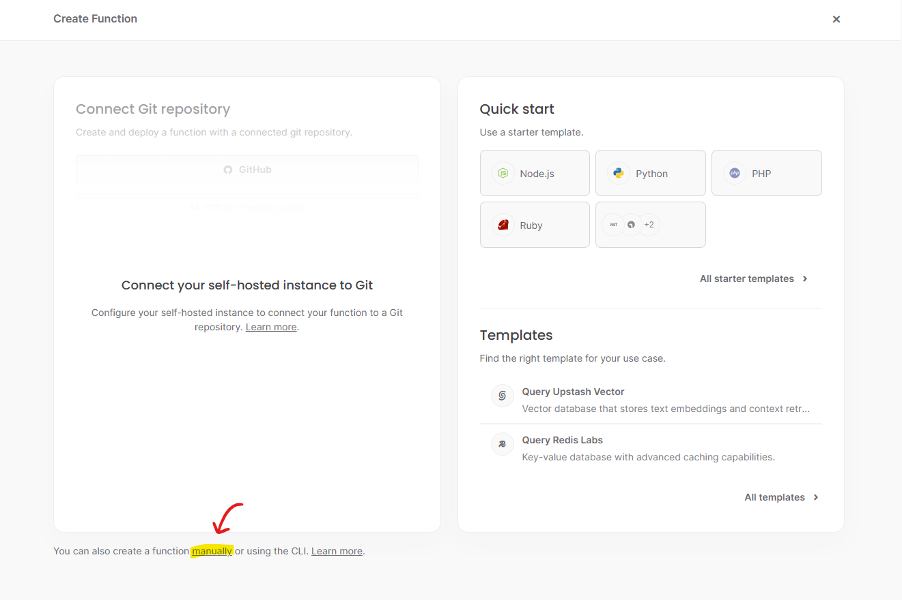

# appwrite_functions_node_example1

## 概要
* Appwrite の Functions で Node.js を使って hello world! を返すだけのサンプル  
* マニュアルデプロイ(手動でソースを tar.gz にしてアップする) 
* Appwrite はセルフホスト ※ Version 1.6.0

※プロジェクトは作成済みの前提で記載しています。  
※試しに実行するだけの設定です。実際に利用する際は適宜変更してください。

## TODO
* 作成した Function にアクセスする URL が `[UNIQUE_ID].[_APP_DOMAIN_FUNCTIONS]` (例: `64d4d22db370ae41a32e.example.com`) のようにサブドメインになるため、サブドメインに対応していないと URL にアクセスできない。
* CLI でデプロイする手順

## 目次
* [src を tar.gz にアーカイブ](#src-を-targz-にアーカイブ)
* [hello-world Function を作成](#hello-world-function-を作成)
* [試しに実行](#試しに実行)
* [コードを更新し再デプロイする](#コードを更新し再デプロイする)

## 詳細

### src を tar.gz にアーカイブ
Git Bash
```sh
tar --exclude hello-world.tar.gz -czf hello-world.tar.gz -C src .
```

### hello-world Function を作成

#### Functions で Create Function をクリック
  

#### 左下 manually をクリック


#### Details に以下を設定し Next をクリック
* Name: hello-world
* Runtime: Node.js - 16.0
* FunctionID: hello-world


#### Configuration に以下を設定し Next をクリック
* Upload a zip file (tar.gz) ... : 先ほど作成した tar.gz をアップロード
* Entrypoint: index.js


#### Permissions に以下を設定し Create をクリック
* Permissions: Any


#### hello-world が作成され、少し待つとビルドが完了し Status が active になる


### 試しに実行

#### 右下 Exectute をクリック


#### そのまま再度右下の Execute をクリック


#### Executions に実行結果が表示されるので、右側 … の Logs をクリック


#### 実行結果の詳細が確認できる
※サンプルコードにエラーログの出力があるので最初に Errors タブが表示されるが意図した動作  


### コードを更新し再デプロイする

#### src を tar.gz に再アーカイブ
Git Bash
```sh
tar --exclude hello-world.tar.gz -czf hello-world.tar.gz -C src .
```

#### Create deployment の Manual をクリック


#### Create manual deployment に以下を設定し Create をクリック
* Gzipped code (tar.gz): 先ほど再作成した tar.gz をアップロード


#### ビルドが完了すると自動的に最新のビルドが active になる
※右側の … から前のビルドに戻したり削除したりも可能


#### 試しに実行すると、ちゃんと更新されている
